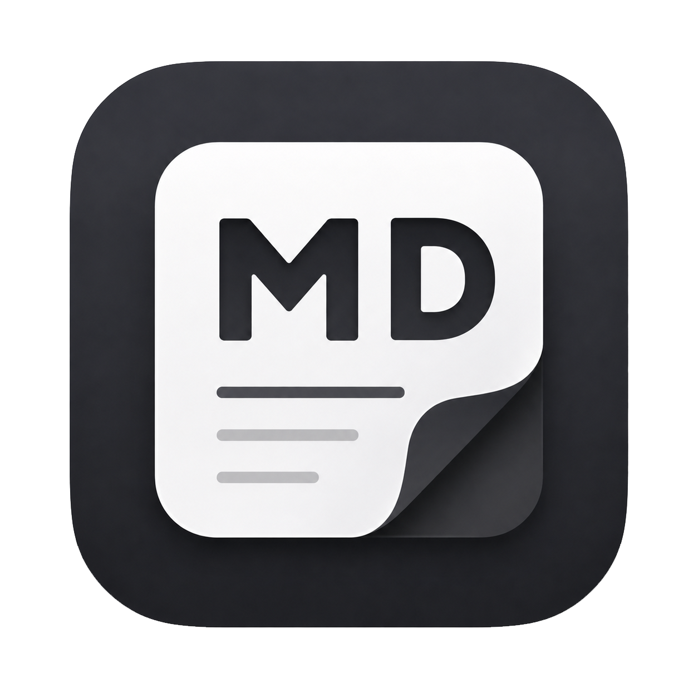

# MD reader

<p align="center">
  
</p>

A clean macOS markdown reader & editor built with Electron.

## Features

- **Reading Mode (Default)** — Opens `.md` files in full-width rendered preview. No distracting source code.
- **Edit Mode** — Click "Edit" to enter split-view: markdown source on left, live preview on right.
- **Multi-Document Tabs** — Left sidebar shows all opened documents. Switch between them instantly.
- **Light/Dark Theme** — Eye-friendly light theme by default (soft grays, not pure white/black). Toggle with `Cmd+Shift+T`.
- **Keyboard Shortcuts** — `Cmd+E` toggle mode, `Cmd+O` open file, `Cmd+S` save.
- **Drag & Drop** — Drop `.md` files directly onto the window.
- **Syntax Highlighting** — Code blocks highlighted via highlight.js.
- **GFM Support** — Tables, strikethrough, task lists, and more.

## Install

Download `MD reader.app` from the repository Releases page, then drag it to `/Applications`.

> First launch: right-click → Open → confirm (unsigned app).

## Build from Source

```bash
git clone <repository-url>
cd <repository-directory>
npm install
npm start          # Run in development
npm run pack       # Package to .app
npm run build      # Package to .app + .dmg
```

## Tech Stack

| Component | Choice |
|-----------|--------|
| Framework | Electron |
| Markdown | markdown-it |
| Code Highlighting | highlight.js |
| Editor | CodeMirror 6 |
| Packaging | electron-builder |

## License

MIT. See [LICENSE](LICENSE).
